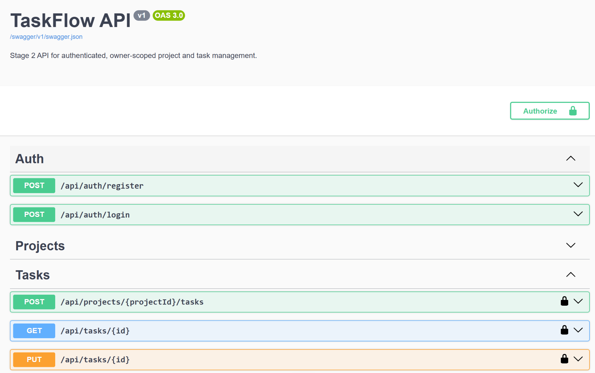
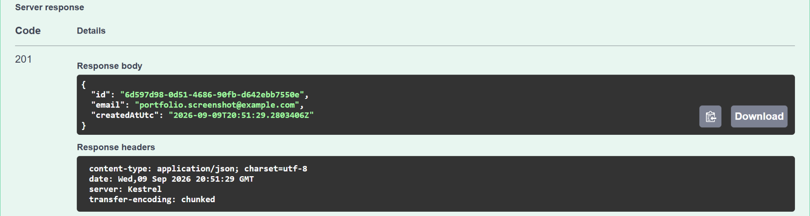
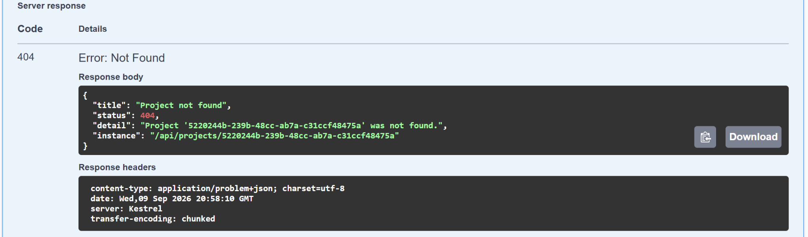

# TaskFlow API

[](https://github.com/ITaEE/taskflow-api/actions/workflows/ci.yml)

A production-style ASP.NET Core REST API for authenticated project and task management. This is a portfolio project focused on practical backend engineering: clean project boundaries, secure local authentication, owner-scoped data access, SQLite persistence, documented HTTP APIs, and integration testing.

## Overview

TaskFlow API lets an authenticated user manage private projects and the tasks within them. The API is intentionally backend-only and uses a simple, inspectable REST design. It currently covers Stage 1 and Stage 2 of the project; later-stage product features are deliberately out of scope.

## Features

- Project and task CRUD operations.
- One project to many tasks relationship.
- Validated task workflow: `Todo` ↔ `InProgress` ↔ `Completed`.
- User registration and login.
- Standard ASP.NET Core password hashing.
- Short-lived JWT bearer access tokens.
- Per-user project ownership and task isolation.
- Consistent `ProblemDetails`-compatible API errors.
- EF Core migrations and SQLite local persistence.
- Swagger UI/OpenAPI documentation in Development.
- Behavior-oriented integration tests covering API, authentication, and ownership scenarios.

## Architecture

The solution is split into four projects with directional dependencies:

```text
Portfolio.TaskFlowApi.Api ──────────────> Portfolio.TaskFlowApi.Core
              │
              └──> Portfolio.TaskFlowApi.Infrastructure ──> Portfolio.TaskFlowApi.Core

Portfolio.TaskFlowApi.Tests ──> Api + Infrastructure + Core
```

- **Core** — domain entities, rules, exceptions, use-case logic, and abstractions. It has no ASP.NET Core, EF Core, or Infrastructure dependency.
- **Infrastructure** — EF Core `DbContext`, SQLite mappings, migrations, repositories, and the password-hashing adapter.
- **Api** — controllers, request/response DTOs, JWT configuration, current-user access, OpenAPI setup, and HTTP error handling.
- **Tests** — integration tests against an isolated in-memory SQLite database.

## Tech Stack

- C# / .NET 8
- ASP.NET Core Web API
- Entity Framework Core 8
- SQLite
- JWT Bearer authentication
- ASP.NET Core `PasswordHasher<User>`
- Swagger / OpenAPI via Swashbuckle
- xUnit and `Microsoft.AspNetCore.Mvc.Testing`

## API Endpoints

| Method | Endpoint | Access | Description |
|---|---|---|---|
| `POST` | `/api/auth/register` | Public | Register a user account |
| `POST` | `/api/auth/login` | Public | Authenticate and obtain a JWT access token |
| `GET` | `/api/projects` | Bearer | List the caller's projects |
| `GET` | `/api/projects/{id}` | Bearer | Get an owned project |
| `POST` | `/api/projects` | Bearer | Create a project |
| `PUT` | `/api/projects/{id}` | Bearer | Update an owned project |
| `DELETE` | `/api/projects/{id}` | Bearer | Delete an owned project and its tasks |
| `GET` | `/api/projects/{projectId}/tasks` | Bearer | List tasks in an owned project |
| `GET` | `/api/tasks/{id}` | Bearer | Get an owned task |
| `POST` | `/api/projects/{projectId}/tasks` | Bearer | Create a task in an owned project |
| `PUT` | `/api/tasks/{id}` | Bearer | Update an owned task |
| `DELETE` | `/api/tasks/{id}` | Bearer | Delete an owned task |
| `PATCH` | `/api/tasks/{id}/status` | Bearer | Change status of an owned task |

Create operations return `201 Created`; updates and deletes return `204 No Content`. Invalid input returns `400 Bad Request`, unauthenticated access returns `401 Unauthorized`, and missing or foreign-owned resources return `404 Not Found`.

## Authentication

Registration accepts an email address and a password. Passwords must be 8–128 characters and are hashed before they reach the database. The API never returns a password hash.

Login returns an access token, expiry time, and safe user information. A token carries user ID, email, issued-at, expiry, and token ID claims. Access tokens default to 60 minutes and may be configured from 1 to 120 minutes.

For incorrect passwords and unknown email addresses, the API returns the same safe `401` response to avoid revealing which part of the credentials was invalid.

## Ownership and Data Isolation

Every project belongs to one user through `OwnerUserId`; tasks inherit ownership through their project. Repository queries are scoped to the authenticated user, rather than relying on ad-hoc controller checks.

As a result:

- A user lists only their own projects.
- A user cannot read, update, delete, or add tasks to another user's project.
- A user cannot read, update, delete, or change status of another user's task.
- Foreign-owned resources resolve as `404 Not Found`, limiting resource-existence disclosure.

## Task Status Workflow

```text
Todo ⇄ InProgress ⇄ Completed
```

Direct `Todo → Completed` and `Completed → Todo` transitions are rejected with `400 Bad Request`.

## Validation and Error Handling

- Project names are required, non-whitespace, and limited to 150 characters.
- Task titles are required, non-whitespace, and limited to 200 characters.
- Descriptions are optional and limited to 2,000 characters.
- New due dates must be future UTC values; updated due dates must be UTC and cannot precede task creation.
- Emails are required, normalized, validated, and unique.
- Passwords are required and limited to 8–128 characters.
- Unknown status values, numeric status values, and invalid state transitions are rejected.

Centralized exception handling returns ProblemDetails-compatible responses for validation failures, duplicate email registration, authentication failures, database conflicts, and unexpected server errors. Stack traces and internal SQL details are not exposed to API clients.

## Database and Migrations

SQLite is used for local development. The default database path is:

```text
Portfolio.TaskFlowApi.Api/Data/taskflow.db
```

The API applies pending EF Core migrations on startup. `InitialCreate` is preserved, while `AddAuthenticationAndOwnership` adds users, normalized-email uniqueness, project ownership, and the user-to-project foreign key.

For a pre-existing Stage 1 database, the Stage 2 migration preserves existing projects by assigning them to a disabled legacy owner. Such projects are not visible to newly registered accounts; reassign or retire them manually before using them in the Stage 2 ownership model.

Project deletion cascades to its tasks. Local database and SQLite journal files are excluded from source control.

## Swagger and OpenAPI

In Development, open:

- Swagger UI: `http://localhost:5117/swagger`
- OpenAPI JSON: `http://localhost:5117/swagger/v1/swagger.json`

Swagger includes a Bearer scheme. The manual workflow is:

1. Call `POST /api/auth/register`.
2. Call `POST /api/auth/login` and copy `accessToken`.
3. Click **Authorize** in Swagger and paste the token.
4. Call protected project and task endpoints.

## Tests

The integration suite contains 62 tests covering project/task CRUD, validation, relationships, cascade deletion, migration application, status rules, registration, login, expired/malformed JWT rejection, safe auth failures, password-hash privacy, Swagger bearer metadata, and two-user ownership isolation. Tests run against an isolated in-memory SQLite database and never modify the local development database.

Run all tests with:

```powershell
dotnet test
```

## Running Locally

Requirements:

- .NET SDK 8 (the repository pins the SDK family in `global.json`)
- A local JWT configuration supplied through environment variables

Restore, build, and run:

```powershell
git clone https://github.com/ITaEE/taskflow-api.git
cd taskflow-api
dotnet restore
dotnet build
dotnet run --project Portfolio.TaskFlowApi.Api
```

## Configuration

JWT configuration is intentionally not stored in `appsettings.json`. Supply the following environment variables externally:

- `JWT__ISSUER`
- `JWT__AUDIENCE`
- `JWT__SIGNING_KEY`

`JWT__SIGNING_KEY` must contain at least 32 UTF-8 bytes. The API does not provide an insecure fallback key; missing or invalid JWT configuration prevents startup.

`JWT__ACCESS_TOKEN_MINUTES` is optional and defaults to 60.

For a local PowerShell session, generate an ephemeral key without committing it:

```powershell
$env:JWT__ISSUER = "TaskFlowApi.Local"
$env:JWT__AUDIENCE = "TaskFlowApi.Swagger"
$env:JWT__SIGNING_KEY = [Convert]::ToBase64String([System.Security.Cryptography.RandomNumberGenerator]::GetBytes(48))
dotnet run --project Portfolio.TaskFlowApi.Api
```

## Migrations

The API applies pending migrations at startup. To apply them explicitly, restore the local EF Core tool and run:

```powershell
dotnet tool restore
dotnet ef database update --project Portfolio.TaskFlowApi.Infrastructure --startup-project Portfolio.TaskFlowApi.Api
```

The JWT environment variables above are also required for this command because the API startup project validates JWT configuration before creating a database context.

## CI

GitHub Actions runs restore, a Release build, and the integration suite for every push and pull request. The tests supply their own clearly isolated test JWT configuration; no production secret is required by CI.

## Publish

Create a self-contained Windows publish output with:

```powershell
dotnet publish Portfolio.TaskFlowApi.Api --configuration Release --runtime win-x64 --self-contained true --output .\artifacts\publish\win-x64
```

`artifacts/` is ignored by Git. Provide JWT configuration externally when starting the published API.

## Security Notes

- No production signing keys, passwords, access tokens, or connection passwords are stored in the repository.
- Password hashes are persistence-only fields and are absent from API DTOs.
- JWT configuration is validated before runtime migrations are applied.
- Test-only credentials and the test-only signing key are isolated in the test project and clearly named as test-only.
- `.gitignore` excludes local databases, SQLite sidecars, `.env` files, local config overrides, logs, coverage files, IDE folders, and build output.

## Project Structure

```text
Portfolio.TaskFlowApi.Api/
  Authentication/        JWT token, options, current-user service
  Contracts/             Request and response DTOs
  Controllers/           Auth, projects, tasks HTTP endpoints
  ErrorHandling/         Centralized ProblemDetails handler
  OpenApi/               Swagger Bearer metadata
Portfolio.TaskFlowApi.Core/
  Abstractions/          Repository, auth, password, token contracts
  Entities/              User, Project, TaskItem
  Services/              Authentication use case
Portfolio.TaskFlowApi.Infrastructure/
  Persistence/           DbContext, mappings, repositories, migrations
  Security/              ASP.NET Core password-hashing adapter
Portfolio.TaskFlowApi.Tests/
  Integration tests and test web host
docs/screenshots/        Portfolio screenshots
```

## Screenshots

### Swagger overview



### Registration



### Ownership isolation



## Future Improvements

The following are intentionally deferred beyond the current portfolio scope: refresh tokens, email confirmation, password reset, OAuth providers, roles/administration, organizations, pagination, frontend work, Docker, PostgreSQL deployment, cloud services, and notifications.
